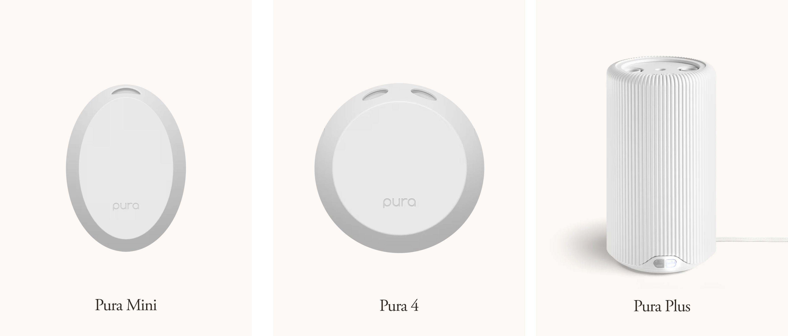

[](https://github.com/homebridge/homebridge/wiki/Verified-Plugins)

**A Homebridge plugin for Pura smart fragrance diffusers.**

By default this plugin exposes a single on/off switch per diffuser. It’s designed to be used with Pura’s away mode and scheduling features disabled, so HomeKit can act as the primary automation layer.

You can optionally enable:
- Intensity Control: fan-style accessory with Subtle/Medium/Strong intensity levels.
- Nightlight Control: supports on/off, Brightness (snapped to Pura's 10-step brightness levels), and color for compatible diffusers.
- Fragrance Controls: one fan-style service per discovered fragrance, with explicit fragrance selection and independent intensity.

## Supported Diffusers
This plugin has been designed and tested for the following diffusers.



## Installation

1. Install this plugin using: `npm install -g @homebridge-plugins/homebridge-pura`
2. Edit your `config.json` file (see sample config below)
3. Run Homebridge

## Requirements

- Homebridge `^1.8.0` (Homebridge v2 beta is also supported)
- Node.js `^18.20.4 || ^20.18.0 || ^22.10.0 || ^24.13.0`

## Configuration

Add the following platform to your `config.json`:

```json
{
  "platforms": [
    {
      "name": "Pura Smart Diffuser",
      "platform": "PuraSmartDiffuser",
      "username": "your-pura-email@example.com",
      "password": "your-pura-password",
      "forceNightlightOff": false,
      "enableFanService": false,
      "enableNightlightAccessory": false,
      "enableFragranceControls": false
    }
  ]
}
```

### Configuration Options

- **username**: Your Pura email - *required*
- **password**: Your Pura password - *required*
- **forceNightlightOff**: Pura turns the nightlight on/off with the diffuser. If enabled, the plugin sends a nightlight-off command right after turning on a diffuser. (default: false)
- **enableFanService (Enable Intensity Control)**: Replaces the on/off switch with a fan accessory to control intensity (Subtle, Medium, Strong). For multi-bay diffusers, HomeKit intensity changes are applied across available bays to keep auto-alternate behavior consistent unless Fragrance Controls are enabled. (default: false)
- **enableNightlightAccessory**: Enables nightlight controls (On/Brightness/Color) for compatible diffusers. (default: false)
- **enableFragranceControls**: Adds one fan-style HomeKit service per discovered fragrance. Services use the Pura fragrance ID for stable identity, follow a fragrance if it moves between bays, select that fragrance when activated, and retain an independent Subtle/Medium/Strong intensity. (default: false)

## Usage

By default, each diffuser appears as a single switch in HomeKit (e.g., "Living Room Diffuser").

If `enableFanService` is set to `true`, each diffuser uses intensity control mode instead, with RotationSpeed mapped to:
- Subtle: 30
- Medium: 50
- Strong: 100

For multi-bay diffusers, intensity changes from HomeKit are synced across available bays.

Switching accessory types will require recreating HomeKit scenes and automations for all Pura diffusers in this plugin.

If `enableNightlightAccessory` is set to `true`, compatible diffusers expose nightlight controls.

If `enableFragranceControls` is set to `true`, each discovered fragrance is exposed as a separate fan-style service named for the installed scent. Activating a fragrance selects its current bay and disables the other fragrance service. This allows HomeKit scenes and schedules to intentionally alternate fragrances without relying on the Pura app's last-selected bay. A fragrance service is keyed by the Pura fragrance ID rather than its bay, so its HomeKit identity remains stable if the vial is moved. Previously discovered fragrances remain available for automations and report unavailable when the vial is not installed.

The plugin records Pura's remaining percentage by stable fragrance ID and reports changes in the Homebridge log. It also exposes each vial's remaining level through a linked HomeKit Battery service (for example, `Salt Remaining`). This is an intentional HomeKit UI abstraction: `BatteryLevel` represents Pura's vial/refill remaining percentage, while `StatusLowBattery` represents Pura's low-fragrance warning. The value follows the fragrance ID if a vial moves between bays.

Fragrance controls use the same intensity mapping as the diffuser fan service:
- Subtle: 30
- Medium: 50
- Strong: 100

The Pura API exposes one active fragrance at a time. "Independent intensity" therefore means each fragrance remembers and applies its own intensity when selected; it does not run both bays simultaneously.

### Controls

- **Power (default mode)**: Turn the diffuser on/off using the switch accessory
- **Intensity Control (optional mode)**: Use the fan-style accessory and set intensity to Subtle, Medium, or Strong
- **Nightlight Control (optional)**:
  - On/Off
  - Brightness (snapped to Pura's 10-step brightness levels)
  - Color (Hue/Saturation)
- **Fragrance Controls (optional)**:
  - Select a fragrance by turning on its named service
  - Set a remembered Subtle/Medium/Strong intensity per fragrance
  - View Pura-reported vial remaining as a battery-style percentage and in the Homebridge log
  - Alternate fragrances using ordinary HomeKit scenes or schedules

### Device Management

The plugin will automatically:
- Discover all Pura devices on your account
- Create one diffuser accessory per device:
  - Switch by default
  - Intensity control accessory when `enableFanService=true`
- Optionally add nightlight controls on compatible models when enabled
- Optionally add stable fragrance-specific controls for installed vials when enabled
- Update device status via realtime updates with a 5-minute polling fallback (15s when realtime is down)
- Handle authentication and token refresh (including periodic Cognito refresh polling)

## Recommended Usage

- Use this plugin in lieu of Pura schedules or away mode.
- If Fragrance Controls are disabled, enable **Auto-alternate fragrances** in the Pura app to ensure equal scent distribution.

## Troubleshooting

### Authentication Issues

If you encounter authentication errors:
1. Verify your username and password are correct
2. In Homebridge UI, click **Verify** before clicking **Save**
3. Check that your Pura account is active and can log in to the mobile app
4. Ensure your internet connection is stable

### Device Not Appearing

If your Pura device doesn't appear in HomeKit:
1. Check that the device is online and connected to WiFi
2. Verify it appears in the Pura mobile app
3. Check Homebridge logs for error messages
4. Try restarting Homebridge

### Connectivity Issues

If the plugin loses connection:
1. Check your internet connection
2. Verify Pura services are operational
3. Try restarting the plugin by restarting Homebridge

## Support

For issues and feature requests, please use the [GitHub Issues](https://github.com/homebridge-plugins/homebridge-pura/issues) page.

## Credits

This plugin is inspired by and based on the [pypura](https://github.com/natekspencer/pypura) Python library by @natekspencer.

## License

Apache-2.0
