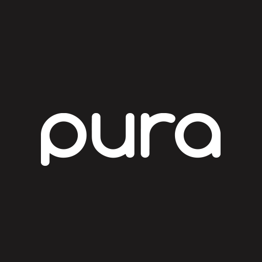
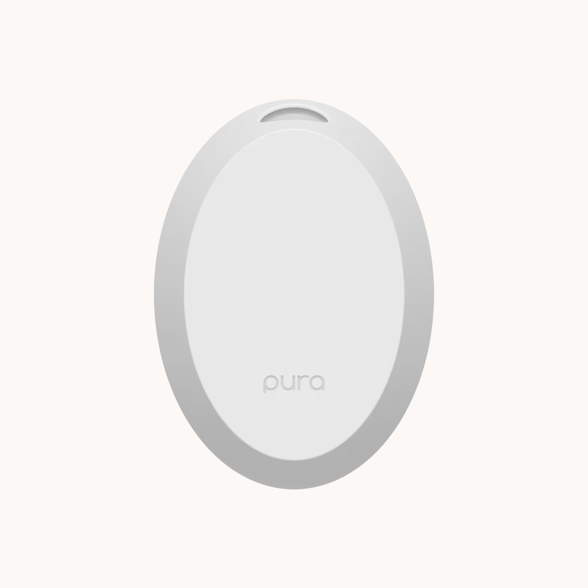
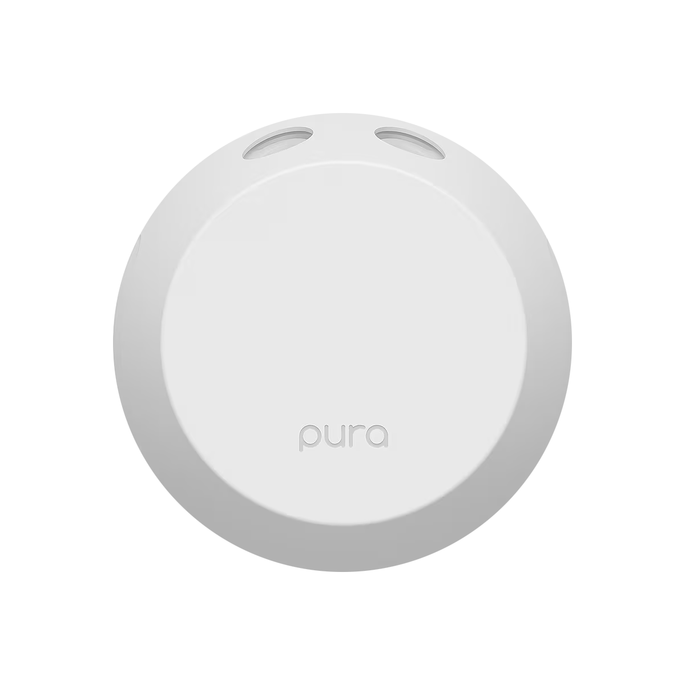
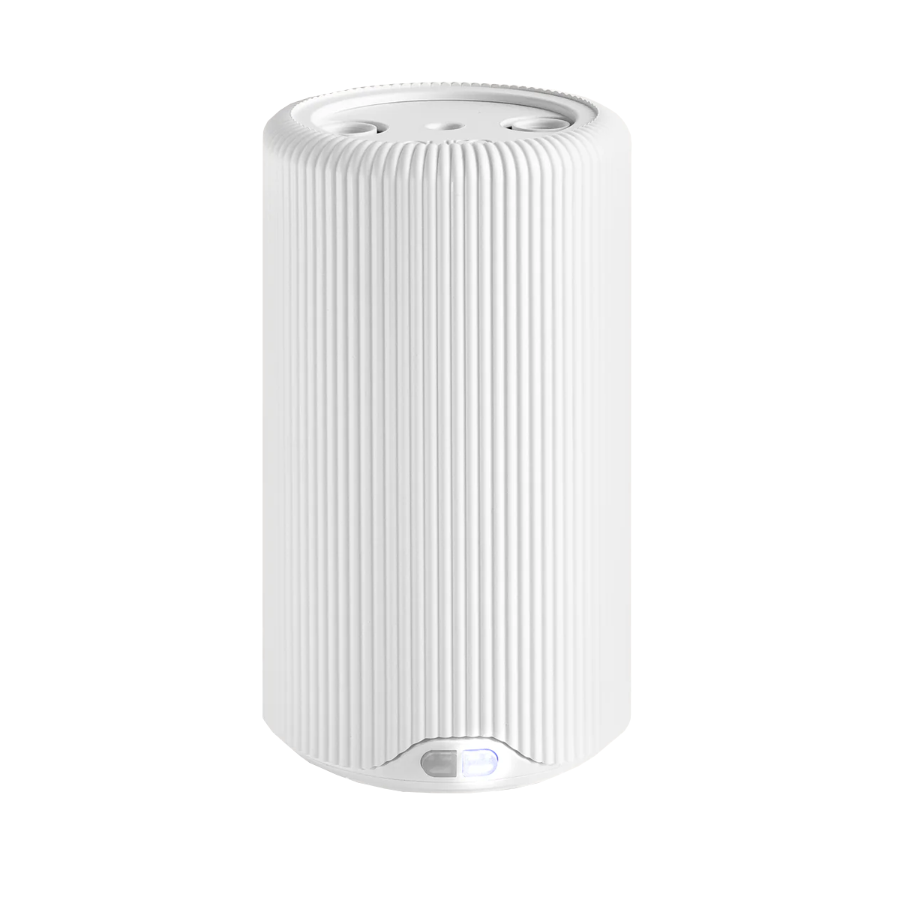
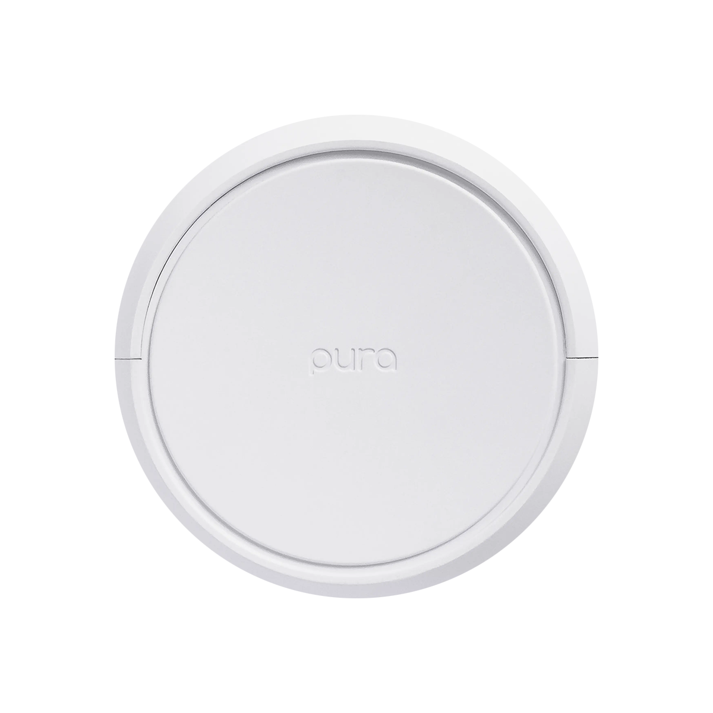

[](https://github.com/homebridge/homebridge/wiki/Verified-Plugins)

**A Homebridge plugin for Pura smart fragrance diffusers.**

By default this plugin exposes a single on/off switch per diffuser. It’s designed to be used with Pura’s away mode and scheduling features disabled, so HomeKit can act as the primary automation layer.

You can optionally enable:
- Intensity Control: fan-style accessory with Subtle/Medium/Strong intensity levels.
- Nightlight Control: supports on/off, Brightness (snapped to Pura's 10-step brightness levels), and color for compatible diffusers.
- Bay Control: a separate tile per fragrance bay, named after the scent in it.
- Auto-Alternate Control: a switch for Pura's Auto-alternate fragrances setting on multi-bay diffusers.

## Supported Diffusers
This plugin is designed for the following diffusers. Every model gets an on/off
control by default. Everything else is opt-in, see
[Configuration Options](#configuration-options).

| | Diffuser | Fragrance bays | Intensity control | Nightlight control |
|:--:|:--|:--:|:--|:--:|
|  | **Pura Mini** | 1 | Subtle / Medium / Strong | Yes |
|  | **Pura 4** | 2 | Subtle / Medium / Strong | Yes |
|  | **Pura Plus** | 2 | Subtle / Medium / Strong | No <sup>1</sup> |
|  | **Pura Home** | 2 | Subtle / Medium / Strong | Yes <sup>2</sup> |

<sup>1</sup> The Pura Plus has an ambient light, but the plugin does not expose it as a HomeKit
nightlight.

<sup>2</sup> The Pura Home has not yet been exercised against physical hardware. Its controls
follow the same path as every other model, so they are expected to work, but it will report a
generic model name in HomeKit until its hardware version is known. If you own one, a
[report](https://github.com/homebridge-plugins/homebridge-pura/issues) of the `hwVersion` from a
debug log would let us label it correctly.

Other Pura hardware that reports itself through the same API, including the Pura 3 and the Pura
Car, is picked up automatically and gets on/off and intensity control, but has likewise not been
verified against a physical device.

## Installation

1. Install this plugin using: `npm install -g @homebridge-plugins/homebridge-pura`
2. Edit your `config.json` file (see sample config below)
3. Run Homebridge

## Requirements

- Homebridge `^1.8.0` or `^2.0.0`
- Node.js `^18.20.4 || ^20.18.0 || ^22.10.0 || ^24.13.0`

## Configuration

Add the following platform to your `config.json`:

```json
{
  "platforms": [
    {
      "name": "Pura Smart Diffuser",
      "platform": "PuraSmartDiffuser",
      "username": "your-pura-email@example.com",
      "password": "your-pura-password",
      "forceNightlightOff": false,
      "enableFanService": false,
      "enableNightlightAccessory": false,
      "enableBayControl": false,
      "enableAutoAlternate": false
    }
  ]
}
```

### Configuration Options

Just the right amount of flexibility for the control freak in all of us. Tinker responsibly, though.
Some changes may require recreating existing HomeKit scenes or automations for your Pura diffusers.

- **username**: Your Pura email - *required*
- **password**: Your Pura password - *required*
- **forceNightlightOff (Force Nightlight Off)**: No mood lighting, please. Pura normally syncs the nightlight with the diffuser. Turn this on to keep the nightlight off while the diffuser is running. (default: false)
- **enableFanService (Enable Intensity Control)**: Because “on” and “off” aren’t enough choices. Replaces the on/off switch with a fan control for choosing Subtle, Medium, or Strong intensity. On multi-bay diffusers, intensity changes apply across available bays to keep auto-alternate working as expected. (default: false)
- **enableBayControl (Enable Per-Bay Controls)**: For those who like to pick favorites. Gives each fragrance bay its own HomeKit control. With Intensity Control enabled, each bay appears as a fan; otherwise, it appears as a switch. On diffusers that only run one bay at a time, turning one bay on turns the other off. Bays are named after the scent in them, see [Bay Names](#bay-names). (default: false)
- **enableNightlightAccessory (Enable Nightlight Controls)**: Set the vibe along with the scent. Adds HomeKit controls for the nightlight, including On/Off, Brightness, and Color, on compatible diffusers. (default: false)
- **enableAutoAlternate (Enable Auto-Alternate Control)**: Can’t pick a favorite? Let Pura play referee. Adds a HomeKit switch for Pura’s Auto-Alternate setting on multi-bay diffusers. When on, Pura rotates between fragrance bays over time; when off, it sticks with the bay you choose. Either way, only one bay diffuses at a time. (default: false)

## Usage

By default, each diffuser appears as a single switch in HomeKit (e.g., "Living Room Diffuser").

If `enableFanService` is set to `true`, each diffuser uses intensity control mode instead, with RotationSpeed mapped to:
- Subtle: 30
- Medium: 50
- Strong: 100

For multi-bay diffusers, intensity changes from HomeKit are synced across available bays.

Switching accessory types will require recreating HomeKit scenes and automations for all Pura diffusers in this plugin.

If `enableNightlightAccessory` is set to `true`, compatible diffusers expose nightlight controls.

### Bay Control

With `enableBayControl` set to `true`, a multi-bay diffuser shows one tile per bay instead of one
tile for the diffuser. Each bay can be turned on and, with intensity control also enabled, set to
its own level.

A diffuser runs one bay at a time, so turning on a bay turns the other off. That is true whether or
not Auto-alternate is on: alternating means the device rotates between the bays over time, not that
both diffuse at once. Turning a bay on from HomeKit does not change the Auto-alternate setting.

A bay with no vial in it reads as off and refuses to turn on, with a note in the log saying why. A
bay whose fragrance Pura reports as spent still works, because the diffuser goes on running it.

### Bay Names

Bay tiles are named after the fragrance loaded in them, and follow a vial swap:

| Bays | Tile names |
| --- | --- |
| Different scents | `Volcano`, `Salt` |
| The same scent in both | `Bay 1: Volcano`, `Bay 2: Volcano` |
| One bay empty | `Volcano`, `Bay 2` |
| Both empty | `Bay 1`, `Bay 2` |

The bay number appears only when the scent alone would not tell the bays apart. That keeps voice
control exact where it can be: "turn on Volcano" matches the tile when the scents differ, and is
ambiguous anyway when they do not.

If you rename a bay tile yourself in the Home app, your name stays until the next time that bay's
fragrance changes, at which point the plugin renames it again. HomeKit does not tell a plugin that
a user has renamed something, so there is no way to detect and respect it. This is a consequence of
keeping names in step with what is loaded rather than a bug, and it only applies with
`enableBayControl` turned on.

### Controls

- **Power (default mode)**: Turn the diffuser on/off using the switch accessory
- **Intensity Control (optional mode)**: Use the fan-style accessory and set intensity to Subtle, Medium, or Strong
- **Bay Control (optional)**: Turn each fragrance bay on or off, and set its intensity, from its own tile
- **Nightlight Control (optional)**:
  - On/Off
  - Brightness (snapped to Pura's 10-step brightness levels)
  - Color (Hue/Saturation)

### Device Management

The plugin will automatically:
- Discover all Pura devices on your account
- Create one diffuser accessory per device:
  - Switch by default
  - Intensity control accessory when `enableFanService=true`
  - One tile per fragrance bay when `enableBayControl=true`
- Optionally add nightlight controls on compatible models when enabled
- Update device status via realtime updates with a 5-minute polling fallback (15s when realtime is down)
- Handle authentication and token refresh (including periodic Cognito refresh polling)

## Recommended Usage

- Use this plugin in lieu of Pura schedules or away mode.
- Enable **Auto-alternate fragrances** to spread wear evenly across both bays. With
  `enableAutoAlternate` you can toggle it from HomeKit instead of the Pura app.
- Turn on `enableBayControl` if you want to choose which scent is running. Leave it off to keep a
  single tile per diffuser.

## Troubleshooting

### Authentication Issues

If you encounter authentication errors:
1. Verify your username and password are correct
2. In Homebridge UI, click **Verify** before clicking **Save**
3. Check that your Pura account is active and can log in to the mobile app
4. Ensure your internet connection is stable

### Device Not Appearing

If your Pura device doesn't appear in HomeKit:
1. Check that the device is online and connected to WiFi
2. Verify it appears in the Pura mobile app
3. Check Homebridge logs for error messages
4. Try restarting Homebridge

### Connectivity Issues

If the plugin loses connection:
1. Check your internet connection
2. Verify Pura services are operational
3. Try restarting the plugin by restarting Homebridge

## Support

For issues and feature requests, please use the [GitHub Issues](https://github.com/homebridge-plugins/homebridge-pura/issues) page.

## Credits

This plugin is inspired by and based on the [pypura](https://github.com/natekspencer/pypura) Python library by @natekspencer.

## License

Apache-2.0
